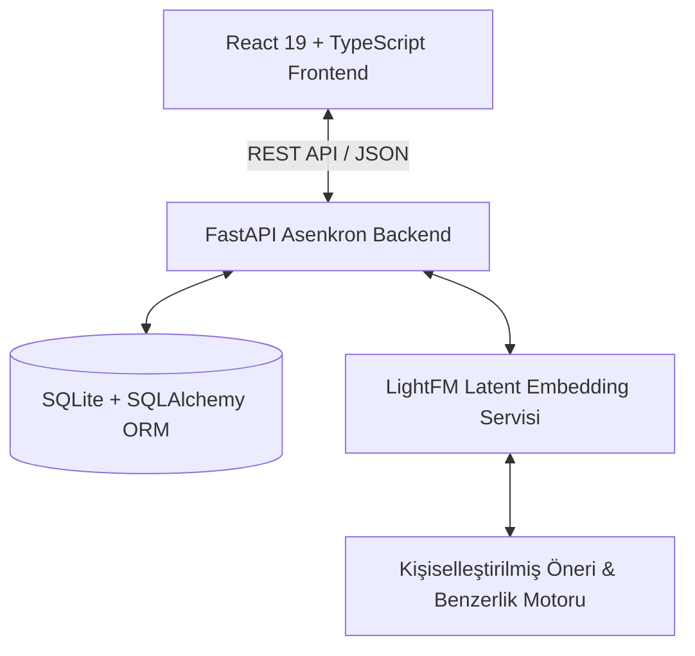

# 🍳 Food.com Veri Seti ile İşbirlikçi Filtreleme Tabanlı Kişiselleştirilmiş Tarif Öneri Sistemi
### *Personalized Recipe Recommendation System Using Collaborative Filtering Based on the Food.com Dataset*

<div align="center">

[](https://www.pau.edu.tr/)
[](https://www.python.org/)
[](https://fastapi.tiangolo.com/)
[](https://react.dev/)
[](https://www.typescriptlang.org/)
[](https://tailwindcss.com/)
[](https://making.lyst.com/lightfm/)
[](#)

</div>

---

## 📌 Proje ve Tez Hakkında (Overview)

Bu proje, **Pamukkale Üniversitesi Mühendislik Fakültesi Bilgisayar Mühendisliği Bölümü** bünyesinde tamamlanan lisans tezi çalışmasıdır. 

Çevrimiçi tarif platformlarındaki aşırı bilgi yükü nedeniyle kullanıcıların kişisel zevklerine ve beslenme alışkanlıklarına uygun tarifleri keşfetmesi zorlaşmaktadır. Bu çalışma; dünyaca kabul görmüş **Food.com** veri seti üzerinde **%99.99 seyreklik** içeren kullanıcı-tarif etkileşimlerini analiz ederek, kullanıcıların gizli (latent) tercihlerini ortaya çıkaran **Hibrit İşbirlikçi Filtreleme (Collaborative Filtering)** modeli ve modern bir web platformu sunmaktadır.

### 🎓 Akademik Künye
* **Tez Başlığı:** Food.com Veri Seti Kullanılarak İşbirlikçi Filtreleme ile Geliştirilmiş Tarif Öneri Sistemi
* **Üniversite:** Pamukkale Üniversitesi, Mühendislik Fakültesi, Bilgisayar Mühendisliği Bölümü
* **Dönem:** Mayıs 2026
* **Yazarlar:** 
  * [Furkan ARAS](https://github.com/furkanaras0) (Öğrenci No: 22253020)
  * İsmail Emirhan YAZICI (Öğrenci No: 21253011)
* **Tez Danışmanı:** Öğr. Gör. Şevket Umut ÇAKIR
* **Jüri Üyeleri:** Dr. Öğr. Üyesi Mustafa TOSUN, Arş. Gör. Koray GÜNEL

---

## 🔬 Bilimsel Metodoloji ve Model Mimarisi

### 1. Veri Ön İşleme & İteratif 10-Core Filtreleme
* **Ham Veri Seti:** 522.517 tarif, 271.907 kullanıcı ve 1.4 milyondan fazla kullanıcı değerlendirmesi/etkileşimi.
* **Veri Seyrekliği:** Etkileşim matrisi üzerindeki seyreklik oranı **%99.99** seviyesindedir.
* **10-Core Filtreleme:** Seyreklik problemini aşmak adına en az 10 tarifle etkileşime girmiş kullanıcılar ve en az 10 farklı kullanıcı tarafından puanlanmış tarifler seçilerek iteratif filtreleme uygulanmıştır.

### 2. TF-IDF Destekli Hibrit LightFM Modeli
* **Matris Çarpanlarına Ayırma (Matrix Factorization):** Kullanıcı-tarif etkileşimleri gizli (latent) uzay vektörlerine indirgenmiştir.
* **Doğal Dil İşleme (NLP & TF-IDF):** Tarif malzemeleri, açıklamaları ve etiketleri TF-IDF ile ağırlıklandırılarak tarif öznitelik matrisine dönüştürülmüştür.
* **Hibrit Entegrasyon:** LightFM mimarisi altında kullanıcı kimlikleri ile metinsel içerik vektörleri doğrusal olarak birleştirilerek hem içerik hem de işbirlikçi sinyaller tek bir modelde eğitilmiştir.
* **Vektörel Benzerlik:** Kullanıcının favorilediği tariflerin latent embedding vektörlerinin ortalaması alınarak kullanıcı profili oluşturulmuş ve Cosine Similarity ile en alakalı 30 tarif gerçek zamanlı olarak sıralanmıştır.

### 3. "Cold-Start" (Soğuk Başlangıç) Çözümü
Sisteme ilk kez kaydolan ve henüz geçmiş etkileşimi bulunmayan yeni kullanıcılar için dengeli kategori dağılımına sahip **10 popüler tariften oluşan etkileşimli bir Onboarding (Isındırma) modülü** geliştirilmiştir. Kullanıcı ilk tercihlerini işaretlediği anda latent uzayda kullanıcı vektörü dinamik olarak inşa edilir.

---

## 📊 Deneysel Bulgular ve Model Kıyaslamaları

Modelimiz, literatürdeki temel ve güncel gelişmiş (Derin Öğrenme ve Graf Tabanlı) modellerle aynı veri kümesi üzerinde 10 öneri (@10) üzerinden test edilmiş ve üstün sıralama başarımı göstermiştir:

### Tablo 1: Temel Model Performans Karşılaştırma Sonuçları (@10)
| Model | Precision@10 | Recall@10 | F1@10 | AUC | Diversity |
| :--- | :---: | :---: | :---: | :---: | :---: |
| LightFM (Alpha=1.0) | 0.0076 | 0.0138 | 0.0098 | **0.8191** | 0.7972 |
| Hibrit SBERT (0.7) | 0.0079 | 0.0147 | 0.0103 | 0.8045 | 0.7408 |
| TFRS (Standart) | 0.0010 | 0.0028 | 0.0015 | 0.7308 | **0.9081** |
| **TF-IDF + LightFM (Önerilen)** | **0.0202** | **0.0301** | **0.0242** | 0.7853 | 0.8338 |

### Tablo 2: Güncel Derin Öğrenme ve Graf Modelleri ile Kıyaslama (@10)
| Model | Model Mimarisi | Recall@10 | NDCG@10 |
| :--- | :--- | :---: | :---: |
| **BPRMF** | Matris Çarpanları | 0.0236 | 0.0222 |
| **LightGCN** | Graf Sinir Ağı (GNN) | 0.0263 | 0.0241 |
| **BM3** | Derin Öğrenme | 0.0271 | 0.0253 |
| **TESMR** | Çoklu Kiplikli (Multimodal) | 0.0290 | 0.0272 |
| **TF-IDF + LightFM (Bu Çalışma)** | **Hibrit Matris Çarpanları** | **0.0301** | **0.0303** |

> 🏆 **Sonuç:** Geliştirilen **TF-IDF + LightFM** modeli, karmaşık derin öğrenme ve graf modellerini geride bırakarak **0.0303 NDCG@10** skoru ile en doğru sıralama başarımını elde etmiştir.

---

## 💻 Sistem Mimarisi & Teknoloji Yığını



### Katmanlar ve Teknolojiler:
* **Frontend:** React 19, TypeScript, Vite, Tailwind CSS v4, Motion (Framer Motion), Lucide Icons, React Router v7.
* **Backend:** Python 3.10+, FastAPI, Pydantic, SQLAlchemy ORM, SQLite, Passlib/Bcrypt, Python-Jose (JWT).
* **Makine Öğrenmesi & Veri:** LightFM, Scikit-learn (TF-IDF), Pandas, NumPy, SciPy (Sparse Matrisler).

---

## ✨ Uygulama Özellikleri

* 👤 **Kullanıcı Doğrulama (Auth):** JWT tabanlı güvenli kayıt, giriş ve profil yönetimi.
* 🚀 **Kişiselleştirilmiş Onboarding:** Yeni kullanıcılar için soğuk başlangıcı engelleyen 10 kartlık ilk tercih modülü.
* 🎯 **Dinamik Öneri Akışı:** Favorilenen tariflerin gizli vektör temsillerine göre kişiye özel ilk 30 tarif önerisi.
* 🔍 **Arama ve Kategorizasyon:** Süre (15-dakika altı), öğün tipi (Kahvaltı, Akşam), mutfak türü ve diyet etiketlerine göre dinamik filtreleme.
* 📖 **Detaylı Tarif Sayfası:** Besin değerleri (kalori, protein, karbonhidrat), adım adım pişirme yönergeleri ve malzeme listesi.
* 💖 **Favori Yönetimi:** Beğenilen tariflerin anlık kaydedilmesi ve profil sayfasında listelenmesi.

---

## 📂 Dizin Yapısı

```bash
Tez-recipe-recommender-system/
├── backend/
│   ├── api/                 # FastAPI rota tanımları (auth, routes, users)
│   ├── core/                # Yapılandırma, veritabanı bağlantısı ve JWT güvenliği
│   ├── models/              # SQLAlchemy veri modelleri (User, Favorites)
│   ├── schemas/             # Pydantic istek/yanıt şemaları
│   ├── services/            # RecommenderService (LightFM ve Cosine Similarity motoru)
│   ├── main.py              # Backend başlangıç noktası
│   └── requirements.txt     # Python bağımlılıkları
├── frontend/
│   ├── src/
│   │   ├── components/      # Navbar, Footer, RecipeCard vb.
│   │   ├── pages/           # Home, RecipeDetail, Categories, Profile, Auth, Onboarding
│   │   ├── lib/             # Yardımcı araçlar ve utils
│   │   ├── App.tsx          # Ana uygulama ve sayfa rotaları
│   │   └── index.css        # Tailwind CSS stilleri
│   ├── package.json         # Node bağımlılıkları
│   └── vite.config.ts       # Vite yapılandırması
├── model_egitim_dosyalari/  # Model eğitimi ve deney notebookları/kodları
├── FURKAN_ARAS_İSMAİL_EMİRHAN_YAZICI.pdf  # Lisans Tezi Tam Metni
├── schema.json              # Örnek tarif JSON veri yapısı
└── README.md                # Proje dokümantasyonu
```

---

## 🚀 Kurulum ve Çalıştırma Rehberi

### Ön Koşullar
* **Python 3.10** veya üzeri
* **Node.js** (v18+) ve **npm**

### 1. Depoyu Klonlayın
```bash
git clone https://github.com/furkanaras0/Tez-recipe-recommender-system.git
cd Tez-recipe-recommender-system
```

### 2. Backend Kurulumu
```bash
cd backend
python -m venv venv

# Windows için venv aktifleştirme:
.\venv\Scripts\activate
# macOS/Linux için: source venv/bin/activate

pip install -r requirements.txt
uvicorn main:app --reload --port 8000
```
Backend API sunucusu `http://localhost:8000` adresinde çalışacaktır (API belgeleri için Swagger UI: `http://localhost:8000/docs`).

### 3. Frontend Kurulumu
Yeni bir terminal sekmesinde:
```bash
cd frontend
npm install
npm run dev
```
Web arayüzü `http://localhost:3000` adresinde yayına başlayacaktır.

---

## 📜 Akademik Atıf (Citation)

Bu projeyi akademik veya sektörel bir çalışmanızda kullanırsanız lütfen aşağıdaki şekilde atıfta bulununuz:

```bibtex
@thesis{aras_yazici_2026,
  author       = {Furkan Aras and İsmail Emirhan Yazıcı},
  title        = {Food.com Veri Seti Kullanılarak İşbirlikçi Filtreleme ile Geliştirilmiş Tarif Öneri Sistemi},
  school       = {Pamukkale Üniversitesi, Mühendislik Fakültesi, Bilgisayar Mühendisliği Bölümü},
  year         = {2026},
  month        = {Mayıs},
  type         = {Lisans Tezi},
  note         = {Danışman: Öğr. Gör. Şevket Umut ÇAKIR}
}
```

---

## 📄 Lisans
Bu proje Pamukkale Üniversitesi Bilgisayar Mühendisliği Bölümü Lisans Tezi kapsamında geliştirilmiş olup eğitim ve araştırma amaçlı kullanıma açıktır.
